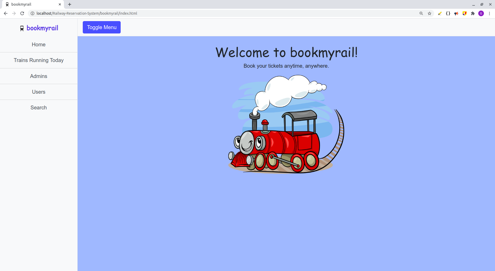
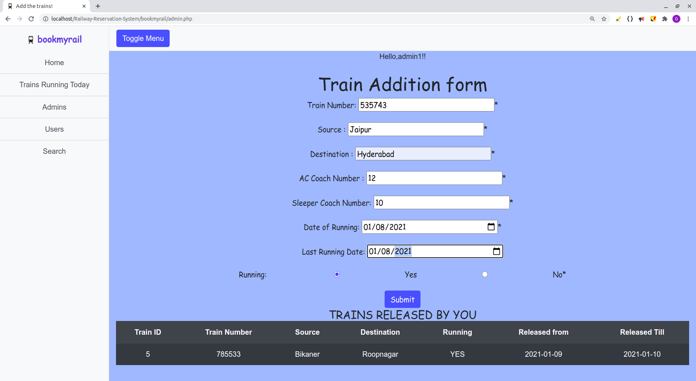
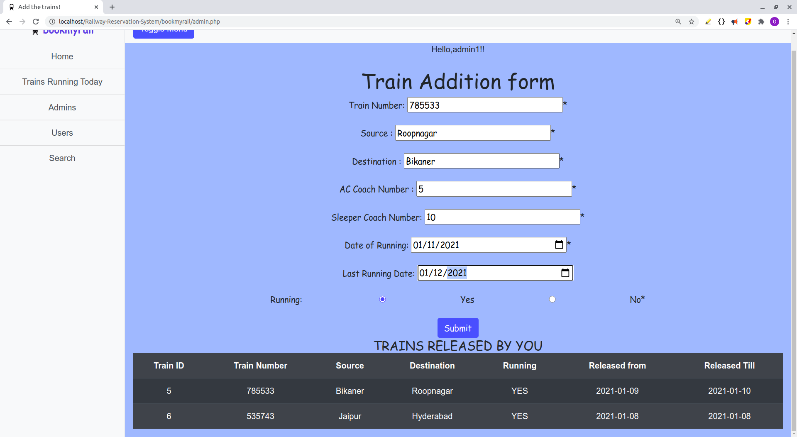
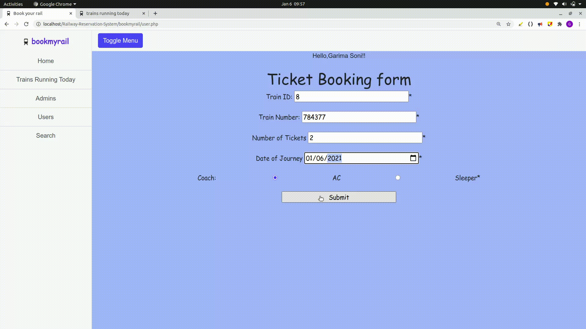
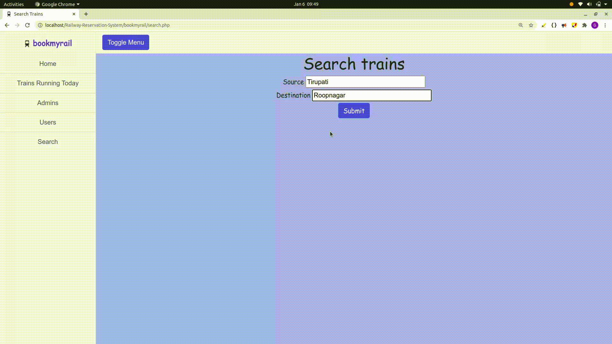

# Bookmyrail

Railway Ticket booking system with psql database in backend.



## Schema

| Tables        | Attributes    |
| ------------- |:-------------:|
| users | user_id(PK), name, email, password, credit_no, address, created_on|
admins | (admin_id(PK), name, email, password, created_on)
trains | (train_number(PK),train_id(PK),train_source, train_destination, ac_coaches, sleeper_coaches, running, released_for, released_till, released_on)
tickets |(ticket_no(PK), train_number, num_of_ticket, coach, booked, released_on)
passengers |(ticket_no(PK), name, age, gender, coach_no(PK), berth_no(PK), berth_type, date)
bookings | (date_dim_id(PK), train_number(PK), ac_booked, sleeper_booked)
books | (user_id, train_number, ticket_number(PK))
berths | (berth_type,berth_no,coach_type)
calendar | (date_dim_id(PK),)

Calendar Table contains the dates and is used in several other relations such as passengers and trains.

Admins Table contains the details of the admins i.e. the people who create trains such as name, email.

Trains Table contains the details of the trains created such as train_no., source, destination, coaches, date of running last_date_of_running.

Berths Table contains the berth system described by the pdf as coach_type,berth_no,berth_type.

Users Table contains the booking agents details such as name, email, credit, card and address.

Books is a relation between the users and the tickets table.

Tickets Table contains the details of the tickets being booked by the booking agent for various passengers.

Passengers Table contains the details of the passengers whose tickets are booked such as name, age, gender.

Bookings Table contains the total number of seats that have been booked for a train on a particular date.

## TICKET BOOKING PROCEDURE

Initially, the admin needs to release the trains he/she wants to run along with the dates on which they shall run.





The user(booking agent) needs to login(register if not registered) and then enter the train number whose tickets he wants to book. The user needs to provide the train number, number of tickets, coach type and date of travel.



If the concerned train is running on that date and has tickets available to suffice the needs of the user(booking agent) then the user shall be redirected to the next page where he needs to enter the details such as name, age and gender of all the passengers for whom the tickets need to be booked and thereafter submitting the details the tickets shall appear with a ticket number, berth type, berth number, coach number, name, age and gender.

If the required number of seats by user ( booking agent ) are not available, the ticket won’t be booked and the user will be redirected to the same page.

The PNR number of tickets is generated using the timestamp at which the user has booked the ticket, it will ensure that the PNR number stays unique throughout. The other thing here to note is 2 tickets cannot have the same PNR number no matter if they are for the same train or different trains.

The berths are allocated on the basis of simple logic -

        1. Assume number of AC coaches are a and number of sleeper coaches are s. Hence, the total number of berths in AC coach are 18*a and number of total berths in sleeper coach are 24*s.
        2. We start the counting from seat number 1 to 18*a in AC and 1 to 24*s in sleeper coaches respectively. 
        3. For finding which seat/berth is vacant next, we use the data of number of ac seats and sleeper seats booked yet for that train for that particular day.

The tables that are affected are as follows **Tickets, Books, Bookings and Passenger**.
When the booking agents demand a ticket can be fulfilled then an entry is made in the tickets, books and bookings tables where the tickets table contains the ticket number and the number of tickets and type of coach. The books table connects the tickets and users table containing the ticket number and user id and then the bookings table updates the booked number of seats in the train number for that date.
Finally, the passengers table contains the details of all the passengers such as name, age, gender berth number berth type coach number. To allot the berth number and type we use the weak entity relation of berths as defined in the pdf which is constant for all the trains.

## TRAIN RELEASE PROCEDURE

To release a train the admin needs to first login(register if not already registered). Thereafter he/she needs to provide the train number for that particular train and it has to be unique(a primary key). The admin also needs to provide the number of coaches of each type and the dates it shall run on.
For dates the admin has options:

        1.He has to provide a start date
        2.He may or may not provide the last date of running i.e. the last date on which the train shall start its routine journey. 
                a.If he does not provide the last date then we are assuming his train will run on all days.
                b.If he provides the last date then the train shall not be released after that date.
        3. To cancel a run immediately the admin can simply put the status of the train as not running.
Affected tables is **Trains**.

## Validations

- Login (Admin & User)

        Username - Not Empty & Valid
        Password - Not Empty & Valid
- Register

        Password - minimun 8 characters
        Username - Contain letters only,Shouldn't AlreadyTaken
        Full Name, Address - Not Empty
        Email - Valid, Not Empty, Shouldn't Already Registered
        Credit Card Number- in the case of the User
- Release Train

        Train Number - Not Empty & Number
        Date - Not Empty & From CURRENT_DATE till 2021
        Number of and Type of Coaches - Positive & Total should be >= 1
- Release Tickets

        Train Id and Number- Not Empty & Number
        Number of Tickets and Coach Type- Not Empty
        Travel Date- Date and from CURRENT_DATE
        Name and Age- Each Passenger's Name and Age

## Other Functionalities

- View Ticket
        - Users can view the ticket by entering a valid Ticket Number
- View All Running Trains
        - Both admins and users can see the details (train number, date of journey, number of AC & sleeper coaches) of all running trains.
- View All Users
        - Admins can see the details of all users registered in the system.
- View All Bookings
        - Admins can also view details of bookings made by all the users.
- Search trains of your interest


## Tech Stack

- ### Frontend

        HTML
        CSS
        Bootstrap

- ### Backend

        PHP

- ### Database

        PGSQL

- ### Server

        Apache

## How to run locally
### Windows
- Install [XAMPP](https://www.apachefriends.org/index.html) on your system
- Clone the repository in ```C:/xampp/htdocs```
- Start Apache & PgSql Servers from XAMPP Control Panel
- Visit "http://localhost/phpmyadmin" on your browser
- Create a new database ```rdb```  and then click Import
- Select ```sql/rdb.sql``` & database will be loaded
- Open "http://localhost/Bookmyrail" on your browser
- Now you are all set to start!
### Ubuntu
- Install PHP and PSQL on your system. ([This](https://medium.com/@Riverside/how-to-install-apache-php-postgresql-lapp-on-ubuntu-16-04-adb00042c45d) article may help).
- Open "http://localhost/phppgadmin/" on your system and login with your psql credentials.
- Navigate to "/var/www/html/" either using terminal or through file manager. 
- Clone the repository here.
- Visit "http://localhost/Bookmyrail".

## Directory Structure

``` 
railway-reservation-system
|-bookmyrail
    ├─ admin.php
    ├─ connectdb.php
    ├─ existing_admin.php
    ├─ existing_user.php
    ├─ simple-sidebar.css
    ├─ index.html
    ├─ passenger.php
    ├─ search.php
    ├─ tickets.php
    ├─ trains.php
    ├─ user.php
    ├─ all-users.php
    ├─ welcome_new_admin.php
    ├─ welcome_new_user.php
    ├─ Project Specification.pdf
    ├─ README.md
    ├─ register.php
    ├─ release-train.php
    ├─ bookings.php
    ├─ Assets
       ├─ berth.sql
       ├─ calender.sql
       ├─ train_update_trigger.sql
```

## ASSUMPTIONS MADE

- Every Train Starts A New Journey From Source To Destination On A New Date : Each train will complete its journey from source to destination and then from destination to source in one day.

- Every Train runs only once a day.

- We assumed a user as a booking agent ( who can book tickets for many passengers).

- The tables- berths and Calendar are not updated throughout, instead, we used these for reference.

- At one time, only one user/admin is using the application - we used **_SESSION** variable from php to store the information about which user/admin is using the application right now.
